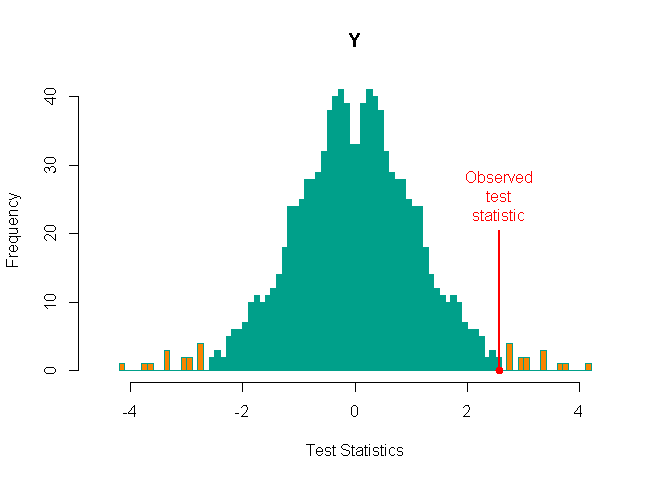
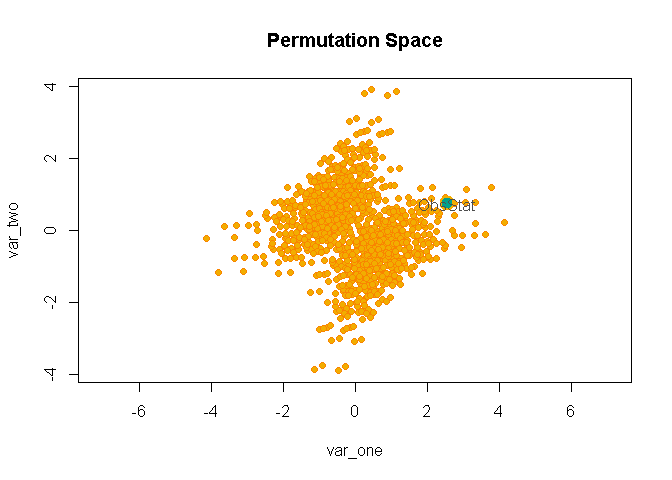
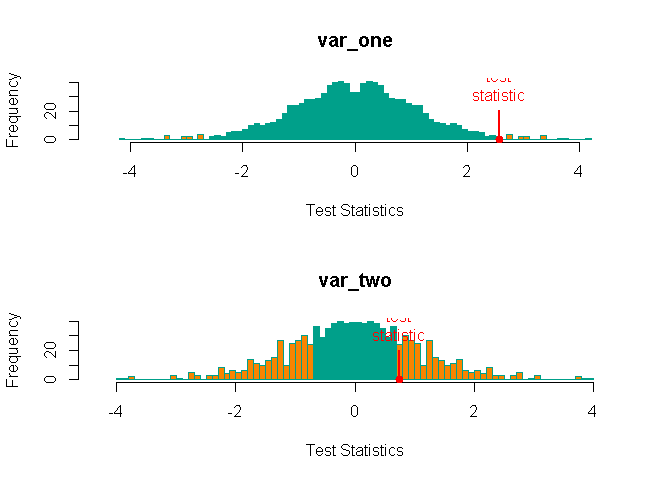

<!-- README.md is generated from README.Rmd. Please edit that file -->
Welcome to the dev-version of the library
=========================================

[flip](http://cran.r-project.org/web/packages/flip/index.html) on CRAN

------------------------------------------------------------------------

Installation
------------

You can install the flip form CRAN

``` r
install.packages("flip")
```

You can install the dev-version of flip from GitHub with:

``` r
# install.packages("devtools")
devtools::install_github("livioivil/flip")
```

------------------------------------------------------------------------

Some examples
-------------

``` r
library(flip)
```

### Univariate analysis

Testing the symmetry around 0 in a one sample (i.e. equivalent to one sample t-test)

``` r
set.seed(1)
one_sample <- rnorm(10) + 0.5
test_one_flip  <- flip(one_sample)
summary(test_one_flip)
#>  Call:
#>  flip(Y = one_sample) 
#> 1023 permutations.
#>   Test  Stat tail p-value sig.
#> Y    t 2.561   ><  0.0293    *
```

and ploting

``` r
plot(test_one_flip) # NOTE: same ad hist(test_flip)
```



### Multivarite analysis

``` r
set.seed(1)
multi_sample    <- data.frame(
  var_one = rnorm(10) + 0.5,
  var_two = rnorm(10)
)
test_multi_flip <- flip(~., data = multi_sample)
summary(test_multi_flip)
#>  Call:
#>  flip(Y = ~., data = multi_sample) 
#> 1023 permutations.
#>         Test   Stat tail p-value sig.
#> var_one    t 2.5612   ><  0.0293    *
#> var_two    t 0.7358   ><  0.4844
plot(test_multi_flip) 
```



Which is different from ploting

``` r
# set `par(mar = c(1, 1, 1, 1))` if you get an error (mostly using Rstudio)
hist(test_multi_flip)
```



------------------------------------------------------------------------

References
----------

For the general framework of univariate and multivariate permutation tests see:

*Pesarin, F. (2001) Multivariate Permutation Tests with Applications in Biostatistics. Wiley, New York.*

For analysis of mixed-models see:

*L. Finos and D. Basso (2014) Permutation Tests for Between-Unit Fixed Effectsin Multivariate Generalized Linear Mixed Models. Statistics and Computing. Volume 24, Issue 6, pp 941-952. DOI: 10.1007/s11222-013-9412-6*

*D. Basso, L. Finos (2011) Exact Multivariate Permutation Tests for Fixed Effects in Mixed-Models. Communications in Statistics - Theory and Methods. DOI 10.1080/03610926.2011.627103*

For Rotation tests see:

*Langsrud, O. (2005) Rotation tests, Statistics and Computing, 15, 1, 53-60*

*A. Solari, L. Finos, J.J. Goeman (2014) Rotation-based multiple testing in the multivariate linear model. Biometrics. Accepted*

The colors of the plots of library flip are mostly taken from `display.wes.palette(5, "Darjeeling")` of [library(wesanderson)](https://github.com/karthik/wesanderson).

Bug reports
-----------

If you encounter a bug, please file a [reprex](https://github.com/tidyverse/reprex) (minimal reproducible example) on [github](https://github.com/livioivil/flip/issues).
